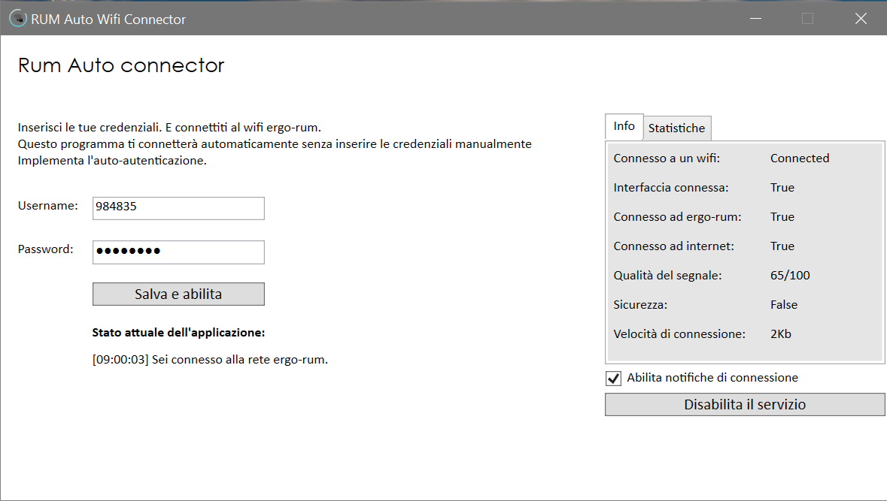

# ergo-rum :sparkles: Wifi auto connector and authenticator for Windows PC
This tool was developed for those who live in the RUM residence in Modena.

### Reason for which it was developed
As soon as I arrived at the residence I noticed that the way to connect to the network was boring.
So I decided to automate the authentication process to keep the connection always active with this support software.

### What can it do?
- It **connects** to the "ergo-rum" wifi network if it **is nearby**
- In addition to connecting, it also **auto-login** with your credentials (which you will enter and save)
- If the network disconnects, it **reconnects instantly**
- It **starts automatically** when the pc is turned on.
- You can *hide* it as an icon.

### Help in development
If you notice any problems, bugs, or you are planning to integrate other functions then do not hesitate to pull request.

> Automatizza senza esitare.
> - Gianluca Mancusi
